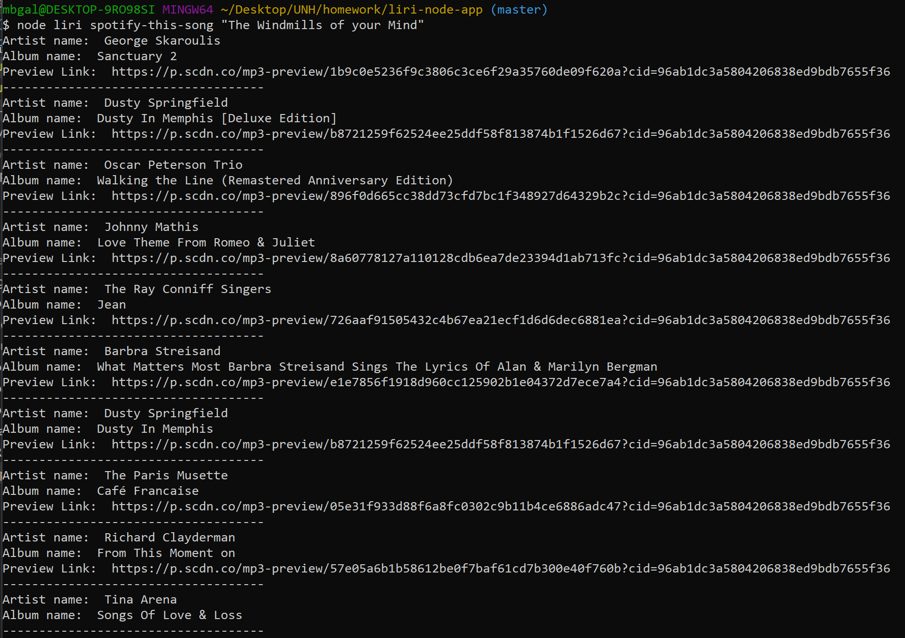
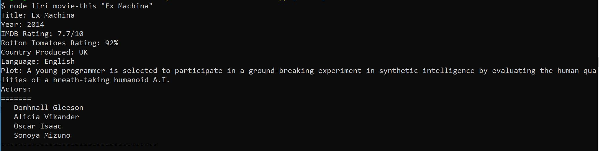
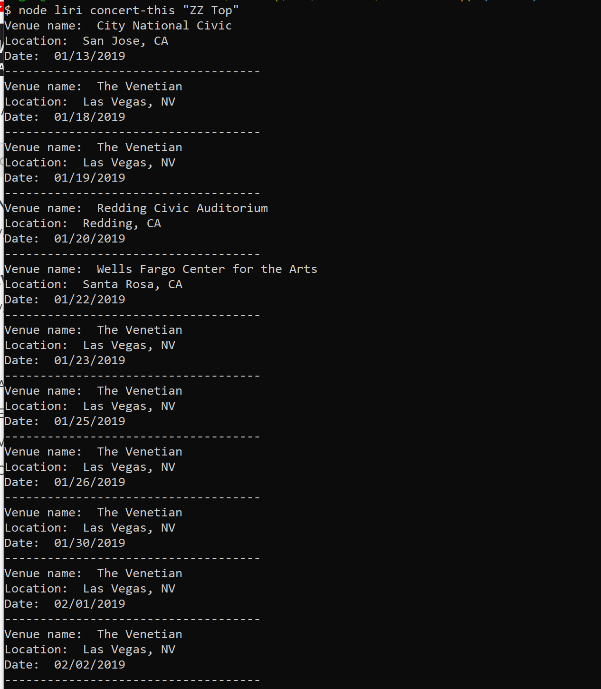
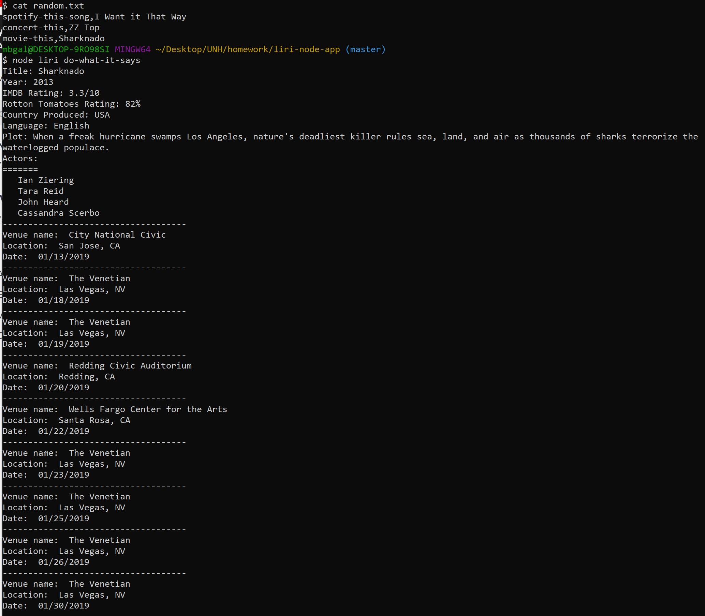

# liri-node-app  

### Overview  
LIRI is like iPhone's SIRI. However, while SIRI is a Speech Interpretation and Recognition Interface, LIRI is a __Language__ Interpretation and Recognition Interface. LIRI is a __command line__ node app that takes in parameters, calls internet APIs and gives back parsed text data.   LIRI's basic function is to query songs from Spotify,  movies from OMDB and concert events from BandsInTown.com.
    
LIRI is a command line application, not a web app.  To use LIRI it will need to be installed locally and access through a series of command line calls using Node.js.   The actual syntax is listed below, as well as some sample calls and output.  
  
__Command line syntax:__   
        `$ node liri {concert-this|spotify-this-song|movie-this|do-what-it-says} {band|song|movie}`   
__Examples:__  
        `$ node liri concert-this "ZZ Top"`  
        `$ node liri spotify-this-song "The Windmills of Your Mind"`    
        `$ node liri movie-this "Ex Machina"`    
        `$ node liri do-what-it-says`    
        `$ node liri prompt-me`  
  
LIRI supports the follow commands and yields the corresponding content:
  
|       | Command           | Result                                                                                                                                                                                                                        |
| ----- | ----------------- | ----------------------------------------------------------------------------------------------------------------------------------------------------------------------------------------------------------------------------- |
| __1__ | spotify-this-song | Artist(s) The song's name A preview link of the song from Spotify The album that the song is from                                                                                                                    |
| __2__ | concert-this      | Name of the venue Venue location Date of the event                                                                                                                                                                      |
| __3__ | movie-this        | Title of the movie Year the movie came out IMDB Rating of the movie Rotten Tomatoes rating of the movie Country where the movie was produced Language of the movie Plot of the movie Actors in the movie |
| __4__ | do-what-I-say     | Runs the commands found in file random.txt                                                                                                                                                                                    |
| __5__ | prompt-me         | Prompts the user through the commands to run                                                                                                                                                                                  |
   
__Note:__ LIRI doesn't like being stood up.  If you can't decide what movie or song to search,  LIRI will supply one for you  

### Demonstration of Functionality 

Each of the following six screenshots give an example of how to call the interface and what to expect from the results.

1) node liri spotify-this-song "Windmills of Your Mind""   
   Sample call to spotify API returning info from the top ten artists publishing the requested song   

  
1) node liri movie-this "Ex Machina"    
  Sample call to the Oneline Movie Database displaying information about the requested movie  

  
3) node liri concert-this "ZZ Top"  
   Sample call to the Bands-In-Town API displaying information about the upcoming concerts  

1) node liri do-what-it-says   
   Sample call to read the content of random.txt file and execute the commands   
   Note the screenshot displays the content of the text file first indicating what commands would be run  

  
1) node liri prompt-me  
   The prompt-me interface walks you through the commands and needed parameters one by one  

  
1) node liri [spotify-this-song|movie-this] {blank}   
   Sample response when LIRI isn't given a movie or song to search   
   Spolier:  the song is "The Sign" by Ace of Base and the movie is "Mr. Nobody"  
![node liri [spotify-this-song|movie-this] <blank>](./assets/images/nochoice-samples.PNG)
  
### Developer notes  
- **.env:**  environment variables used by dotenv package holding secret keys and passwords for API, not included in GIT
- **bandsInTown.js:** the API logic to query bandsintown API  
- **keys.js:**  Module exporting the client keys and passwords
- **liri.js:**  main entry point and command line interface  
- **omdb.js:**  logic to query the omdb movie api  
- **random.txt:**  comma delimited text file of actions and item pairs  
- **spotify.js:**  logic to query the Spotify API for songs   
  
- Spotify API can be found at:  https://developer.spotify.com/
- OMDB API can be found at: http://www.omdbapi.com/    
- BandsInTown API can be found at: https://manager.bandsintown.com/support/bandsintown-api
  
*All APIs require an email to get a registered key*  
  
### How to install/run the application  
1. Download and install the latest version of Node.js following the website instructions for your platform  
   ` https://nodejs.org/en/download/`   
2. Clone this repository into a clean diretory  
   `$ git clone <repository url>`  
3. Bring down the latest package dependencies using node package manager  
   `npm install`  
4. This package requires three keys to access the backend APIS. They are captured in a .env file which must be supplied to the root directory of the project. Use the source locations to request your own keys. Use your favorite IDE to enter the following keys-values pairs to the .env file with your keys supplied.  
  
| API         | Keys Needed (add these to .env file)                                 | Source                                                  |
| ----------- | -------------------------------------------------------------------- | ------------------------------------------------------- |
| Spotify     | SPOTIFY_ID=__yourSpotifyId__ SPOTIFY_SECRET=__yourspotifySecret__ | https://developer.spotify.com/                          |
| OMDB        | OMDB_API_KEY=__yourOMDB_API_KEY__                                    | http://www.omdbapi.com/                                 |
| BandsInTown | BANDSINTOWN_APP_ID=__yourBandsInTownAppId__                          | https://manager.bandsintown.com/support/bandsintown-api |
  
__Note:__  the .gitignore file is coded to preven your keys from being shared in your own git repository if  you so choose    

1. Test the build using the supplied scripts.  Liri will run through through a sample call to each of the three backend APIS and display them on the console  
   `npm test`  
  
### Technology Used
    
| Package/Interface | Version    | Description                                                              |
| ----------------- | ---------- | ------------------------------------------------------------------------ |
| Node.js           | __11.1.0__ | Main javascript engine for this application                              |
| npm Axios         | __0.18.0__ | Package to handle the calls to the backend APIS                          |
| npm Moment JS     | __2.22.2__ | Time library to parse the dates into a readable format                   |
| npm Inquirer      | __6.2.0__  | Library to handle the command line prompting                             |
| npm Spotify       | __1.0.7__  | Package that interfaces back to the spotify API servers                  |
| npm dotenv        | __6.1.0__  | Utility package to hide the secret keys in a .env file and away from git |
| Node fs           | n/a        | Built in file system utility package for reading/writing files           |
| Spotify API       | n/a        | Website interface to access an online song databse                       |
| BandsInTown API   | n/a        | Website interface to access an online concert events                     |
| OMDB API          | __0.8.0__  | Website inteface to access an online movie databse                       |
  
## Authors  
Michael Galarneau - Initial work - five0ffour  
November, 2018  
  
### Acknowledgements  
Spotify - https://www.spotify.com  
OMDB - http://www.omdb.com  
BandsInTown - http://bandsintown.com  